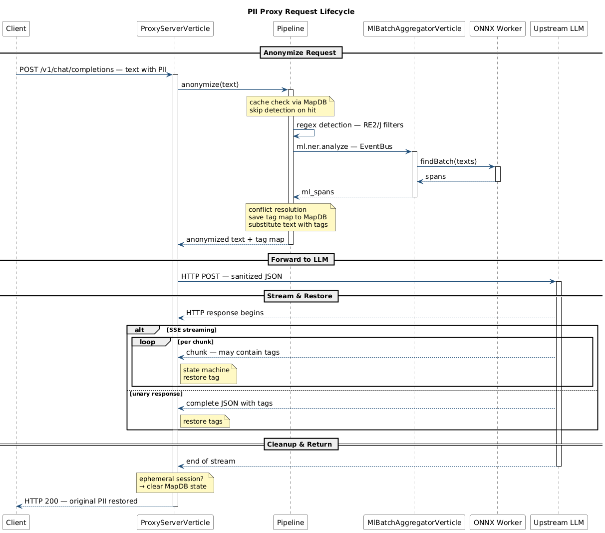

# PII Proxy — Data Privacy Gateway for LLM

Transparent proxy that anonymizes PII in requests to LLM and restores original values in responses. Configurable via YAML — supports custom LLM providers, ONNX NER models, regex filters, and entity resolution strategies, all loaded via reflection.

**Why:** GDPR compliance when integrating cloud LLMs (OpenAI, Anthropic, OpenRouter) into corporate applications. Existing solutions usually are libraries that require deep code changes and do not handle streaming responses well.

**Stack:** Java 21 · Vert.x 5 · ONNX Runtime · RE2/J · MapDB

---

## What is this?

PII Proxy sits between your application and cloud LLMs as a network-level middleware. It transparently replaces PII with placeholder tags before sending requests to the LLM, then restores the original values in the responses — without any code changes to your client application.

```
Input:  "My email is john@example.com, call +1-555-123-4567"
To LLM: "My email is <EMAIL_1>, call <PHONE_1>"

Response from LLM: "Sure! I sent it to <EMAIL_1> and <PHONE_1> for you."
After restoration:  "Sure! I sent it to john@example.com and +1-555-123-4567 for you."
```

### Key features

- **Pluggable LLM providers** — add any provider via YAML config (OpenAI, OpenRouter, custom)
- **Custom ONNX NER models** — drop in any BERT/RoBERTa/DistilBERT NER model
- **Custom regex filters and resolution strategies** — extend via FQCN in config, no code changes
- **Two-way anonymization** — request sanitization + response restoration (including SSE streaming)

---

## Quick Start

### Prerequisites

- Docker, **or** JDK 21
- ~250MB additional disk space for a NER model

### Run with Docker

```bash
# Clone the repository
git clone https://github.com/manlop0/PII-proxy
cd PII-proxy

# Download a NER model (see "Supported Models" below for options)
cd models
bash download.sh <your-model>          # e.g., Babelscape/wikineural-multilingual-ner
python convert_to_onnx.py <your-model>
cd ..

# Configure: edit config.yaml and set model_directory to the downloaded model.
# If your model uses a non-BIO tagging scheme, also set output_adapter.
# nano config.yaml -> model_directory: "./models/<downloaded-model-name>"

# Build and run
docker compose up --build
```

### Test it

```bash
# Without X-Conversation-Id — each request is isolated (ephemeral session).
# MapDB is cleaned up after the response.
curl -X POST http://localhost:8080/<your-provider>/v1/chat/completions \
  -H "Content-Type: application/json" \
  -H "Authorization: Bearer <your-api-key>" \
  -d '{
    "model": "<your-model>",
    "messages": [
      {"role": "user", "content": "My name is John, email john@example.com"}
    ]
  }'

# With X-Conversation-Id — PII mappings persist across requests.
# Repeat messages in the same conversation get cache hits (no ML inference).
curl -X POST http://localhost:8080/<your-provider>/v1/chat/completions \
  -H "Content-Type: application/json" \
  -H "Authorization: Bearer <your-api-key>" \
  -H "X-Conversation-Id: my-chat-session-1" \
  -d '{
    "model": "<your-model>",
    "messages": [
      {"role": "user", "content": "My name is John, email john@example.com"}
    ]
  }'
```

For local testing without an upstream LLM, configure a mock provider — see `loadtest/config.loadtest.yaml` for an example.

---

## How it Works

```
┌────────┐      ┌─────────────┐      ┌─────────┐
│ Client │ ───► │ PII Proxy   │ ───► │   LLM   │
│        │      │             │      │         │
│ "John" │ ◄─── │ "<PERSON_1>"│ ◄─── │response │
└────────┘      └─────────────┘      └─────────┘

1. Anonymize:  regex + ML detect PII, replace with tags
2. Forward:    send sanitized request to upstream LLM
3. Restore:    replace tags back with original values (including SSE chunks)
```

The proxy is transparent: your application sends an HTTP request to `http://localhost:8080/<provider>/...` and receives the response back with PII restored. The request/response format follows the codec configured for the provider (OpenAI-compatible by default; custom codecs supported). PII tags like `<PERSON_1>`, `<EMAIL_1>` are replaced with deterministic placeholders so the LLM treats them as the actual data.

---

## Configuration

All configuration lives in a single `config.yaml` file at the project root. The proxy is built around four pluggable extension points — each supports both built-in shortnames and custom FQCN (Fully Qualified Class Name) for user implementations.

### Server & Storage

```yaml
server:
  port: 8080

storage:
  path: "./data/pii-cache.db"  # Off-heap MapDB persistence
```

### Session handling

The proxy supports two session modes controlled by the optional `X-Conversation-Id` HTTP header. No configuration is required — it works out of the box.

- **Without `X-Conversation-Id`** (ephemeral session) — each request is isolated. The proxy generates a random session ID, performs anonymization, and cleans up the session storage (MapDB) after the response. Use this for one-off API calls (summarization, classification, single-shot prompts) where conversation continuity is not needed.

- **With `X-Conversation-Id`** (persistent session) — the header value is used as the session ID. PII mappings (e.g., `<PERSON_1>` → "John Smith") are stored in MapDB and persist across requests sharing the same header. When the same text appears again in that session, the proxy short-circuits all detection (regex + ML) and returns the cached anonymized text instantly. This dramatically reduces latency for chat-style workloads and multi-turn conversations.

**Recommendation:** for interactive chat applications, always set `X-Conversation-Id` to a stable value per conversation (e.g., derived from your chat/session ID). For one-off API calls, omit it.

The original client request to the upstream LLM is unchanged — the proxy only modifies the URL path (adding `/<provider>` prefix) and optionally adds the `X-Conversation-Id` header.

### LLM Providers

Add any number of providers. Each becomes a route prefix: `/<provider-id>/v1/chat/completions`.

```yaml
providers:
  openai:
    host: api.openai.com
    port: 443
  openrouter:
    host: openrouter.ai
    port: 443
  custom_ai:
    host: api.custom-llm.com
    port: 443
    # "openai" (default) — OpenAI-compatible JSON
    # "com.project.piiproxy.provider.codec.MyCustomCodec" — FQCN of a class implementing LlmJsonCodec with a public no-arg constructor.
    #                       Custom codecs live under com.project.piiproxy.provider.codec.* and are loaded via reflection at startup.
    codec: "com.example.MyCustomCodec"
```

### ML Pipeline

```yaml
ml:
  # Path to directory containing ONNX model, config.json, tokenizer.json
  model_directory: "./models/<your-model>"

  # Batching (internal performance tuning — usually no need to change)
  batch_size: 16
  batch_timeout_ms: 50
  max_queue_size: 1000

  # Tag parsing scheme used by the model:
  #   "BIO" (default) — Beginning-Inside-Outside with continuation tokens
  #   "SIMPLE" — flat tag scheme without prefix
  #   "com.project.piiproxy.pipeline.filter.ml.adapter.MyCustomAdapter" — FQCN of a class implementing ModelOutputAdapter.
  #                       Custom adapters live under com.project.piiproxy.pipeline.filter.ml.adapter.* and are loaded via reflection.
  output_adapter: "BIO"

  # Tags to ignore from ML output (e.g., MISC, DATE)
  ignored_tags: []

  # Map obscure ML tags to human-readable names sent to the LLM
  tag_mapping:
    LOC: "LOCATION"
    PER: "PERSON"
    ORG: "ORGANIZATION"
```

### Pipeline

```yaml
pipeline:
  # Regex filters. Each entry is either a built-in shortname or an FQCN.
  #   Built-in shortnames (live under com.project.piiproxy.pipeline.filter.regex.*):
  #     - "email"        — email addresses (RFC 5322 simplified pattern)
  #     - "phone"        — phone numbers (international / parenthesized / dashed formats)
  #     - "credit_card"  — credit card numbers with Luhn validation
  #     - "ip_address"   — IPv4 addresses in dotted-quad notation
  #   Custom filters: pass the FQCN of a class implementing TextFilter with a public no-arg constructor.
  #                   Custom filters live under com.project.piiproxy.pipeline.filter.regex.* and are loaded via reflection.
  filters:
    names:
      - "email"
      - "phone"
      - "credit_card"
      - "ip_address"
      # - "com.example.MyCustomRegexFilter"

  # Strategy for resolving overlapping spans between regex and ML filters:
  #   "REGEX_PRIORITY" (default) — regex matches override ML predictions on overlap
  #   "LONGEST_WINS" — longest span wins, regardless of source
  conflict_strategy: "REGEX_PRIORITY"

  # Entity resolution (Fuzzy Matching) — groups morphological variations under one tag
  entity_resolution:
    enabled: true
    #   algorithm: "jaro-winkler" (default) — best for names and morphological changes
    #   algorithm: "exact" — disables fuzzy matching, requires exact match
    #   algorithm: "com.project.piiproxy.pipeline.state.resolution.MyCustomStrategy" — FQCN of a class implementing EntityResolutionStrategy.
    #                       Custom strategies live under com.project.piiproxy.pipeline.state.resolution.* and are loaded via reflection.
    algorithm: "jaro-winkler"
    threshold: 0.88  # similarity threshold (0.0–1.0)
    # Only these types undergo fuzzy matching; others require exact match
    fuzzy_types: ["PERSON", "LOCATION", "ORGANIZATION"]

  # System prompt injected to instruct the LLM on how to handle tags
  gateway_system_prompt: >
    System Note: Enterprise Data Privacy Gateway Active.
    You will see entities formatted as tags in the text (e.g., <PERSON_1>).
    CRITICAL INSTRUCTION: You MUST treat these tags as the literal, actual data...
```

---

## Supported Models

Any BERT/RoBERTa/DistilBERT NER model compatible with HuggingFace tokenizers can be used. The default test setup uses a multilingual model that detects persons, organizations, and locations.

```bash
cd models
bash download.sh <huggingface-model-id>     # e.g., Babelscape/wikineural-multilingual-ner
python convert_to_onnx.py <model-name>       # exports to ONNX format
```

For supported models, compatibility checks, and custom adapter development, see **[models/README.md](models/README.md)**.

---

## Docker Deployment

The production setup runs a single container:

```bash
docker compose up --build
```

This mounts:
- `config.yaml` — your configuration (override the default by editing the root file)
- `models/` — read-only model directory
- `data/` — persistent storage for MapDB

To override configuration without rebuilding the image, edit the root `config.yaml` — it is mounted into the container at runtime.

---

## Load Testing

The project includes a k6-based load testing setup with a mock LLM server:

```bash
cd loadtest
./run.sh        # Quick scenarios (~2 min): baseline + ephemeral sessions
./run.sh all    # Full scenarios (~10 min): baseline, ephemeral, persistent, mixed, spike, soak, large_arrays, cache_test
```

Results include k6 metrics (proxy latency, error rate) and detailed logs analysis (ML batching efficiency, cache hit rate, pipeline component timing).

For detailed scenario descriptions and metrics interpretation, see **[loadtest/README.md](loadtest/README.md)**.

---

## Architecture

### Request flow



The diagram above shows the full request lifecycle. In short:

1. **Anonymize Request** — `ProxyServerVerticle` parses the request, `Pipeline` runs cache check → regex detection → batched ML detection (via `EventBus` → `MlBatchAggregatorVerticle` → `ONNX Worker`) → conflict resolution → tag substitution.
2. **Forward to LLM** — sanitized request is sent to the configured upstream LLM provider.
3. **Stream & Restore** — `ProxyServerVerticle` restores tags back to original PII in the response. Supports both SSE streaming (char-by-char state machine) and unary responses.
4. **Cleanup & Return** — ephemeral sessions (no `X-Conversation-Id` header) trigger `MapDB` cleanup; final HTTP 200 sent to the client.

**Cache hit shortcut:** if the client sends the `X-Conversation-Id` header and the same text was already anonymized in that session, the proxy short-circuits all detection (regex + ML) and returns the cached anonymized text instantly. See [Session handling](#session-handling) below.

### Threading model

The proxy uses four execution layers to protect the main event loop from blocking operations:

- **Main event loop** (`ProxyServerVerticle`) — handles HTTP routing, JSON parsing, and dispatches blocking I/O to worker pools.
- **Batch aggregator** (`MlBatchAggregatorVerticle`) — single instance that collects ML requests into batches before dispatching inference.
- **ML inference pool** (dedicated `WorkerExecutor`) — runs ONNX inference off the event loop; sized to `availableProcessors()`.
- **Shared worker pool** — handles MapDB storage I/O via `executeBlocking`, isolated from ML inference.

This separation allows thousands of concurrent connections with bounded latency, since ML inference (the slowest operation) does not block request acceptance or storage operations.

### Top-level packages

```
com.project.piiproxy/
├── config/         # DI wiring, config-driven provider registration
├── pipeline/
│   ├── anonymize/  # Request processing (regex + ML + substitution)
│   ├── restore/    # Response restoration
│   ├── stream/     # SSE state machine
│   ├── state/      # Off-heap storage (MapDB)
│   ├── filter/     # TextFilter chain (regex + ML)
│   └── worker/     # ML batch aggregator
├── provider/       # LLM endpoint abstraction
└── server/         # HTTP handlers
```

---

## Tech Stack

- **Core runtime:** Java 21, Vert.x 5.0.10 (Event Loop, Event Bus, HTTP)
- **ML inference:** ONNX Runtime 1.25.1 (C++ core), DJL HuggingFace Tokenizers 0.36.0 (Rust BPE/WordPiece)
- **Detection & storage:** Google RE2/J 1.8 (DFA regex engine), MapDB 3.0.9 (off-heap persistence)
- **Build & infrastructure:** Gradle (Kotlin DSL), Shadow plugin, Docker multi-stage build, JRE 21
- **Testing:** JUnit 5, Mockito (57 unit tests), k6 (load testing)

## License

MIT — see [LICENSE](LICENSE).